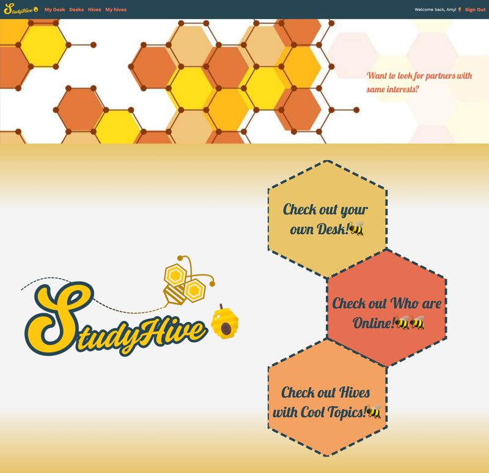

# 🐝 StudyHive

StudyHive is a web application that helps users connect with like-minded individuals to discuss, learn, and grow together. Whether you're studying for an exam or exploring a shared interest, StudyHive allows you to create or join a **Hive**—a virtual space designed for focused collaboration and real-time interaction.




<br>
App home: https://www.studyhive.org/
   
## Features

- 🔍 **Discover Hives** – Find or join study groups based on shared interests.
- 🏠 **Create Your Own Hive** – Become a Hive owner and build your own community.
- 🎥 **Live YouTube Integration** – Owners can update and stream videos in real time.
- 📊 **Interactive Polls** – Easily create polls to engage your Hive members.
- 💬 **Real-time Chat** – Discuss and collaborate with others using instant messaging.

## Getting Started
### Setup

Install gems
```
bundle install
```

### ENV Variables
Create `.env` file
```
touch .env
```
Inside `.env`, set these variables.
```
LINE_CLIENT_ID=your-api-code
LINE_CLIENT_SECRET=your-api-code
GIPHY_API_KEY=your-api-code
OPENAI_ACCESS_TOKEN=your-api-code
CLOUDINARY_URL=your_own_cloudinary_url_key
CLOUDINARY_API_KEY=your_own_cloudinary_api_key
CLOUDINARY_API_SECRET=your_own_cloudinary_api_secret
```

### DB Setup
```
rails db:create
rails db:migrate
rails db:seed
```

### Run a server
```
rails s
```

## Built With
- [Rails 7](https://guides.rubyonrails.org/) - Backend / Front-end
- [Stimulus JS](https://stimulus.hotwired.dev/) - Front-end JS
- [Heroku](https://heroku.com/) - Deployment
- [PostgreSQL](https://www.postgresql.org/) - Database
- [Bootstrap](https://getbootstrap.com/) — Styling
- [Figma](https://www.figma.com) — Prototyping

## Acknowledgements
Inspired by Jane Mount's [Bibliophile](https://www.amazon.com/Bibliophile-Illustrated-Miscellany-Jane-Mount/dp/1452167230) and a story my father once told me: "Why do we keep books? ... We keep books because they remind us of the new perspectives and lessons we learned".

## Team Members
- [Amy Huang](https://www.linkedin.com/in/amyhuang-ntu/)
- [Rayz](https://github.com/authorminator)
- [Ruben Hedström](https://github.com/rubenhed)

## Contributing
Pull requests are welcome. For major changes, please open an issue first to discuss what you would like to change.

## License
This project is licensed under the MIT License


Rails app generated with [lewagon/rails-templates](https://github.com/lewagon/rails-templates), created by the [Le Wagon coding bootcamp](https://www.lewagon.com) team.
